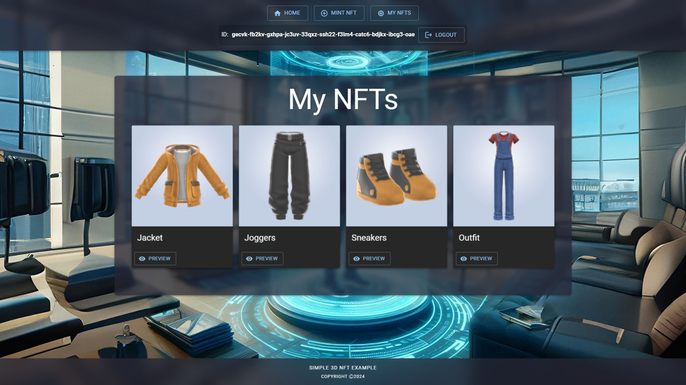

# IC_3DNFT

3D NFT (ICRC-7/37/3 standard) minting and displaying with Internet Identity authentication integration.
<br>
Project is based on PanIndustrial-Org's [NFT Example](https://github.com/PanIndustrial-Org/icrc_nft.mo). Check its documentation on [Internetcomputer's docs](https://internetcomputer.org/docs/current/developer-docs/defi/nfts/nft-collections).
<br>
Backend is written in Motoko, frontend is built using React/JSX and MUI (material UI).

<p align="center"></p>

## Prerequisites 

This example requires an installation of [IC SDK](https://internetcomputer.org/docs/current/developer-docs/setup/install/index.mdx) and [Node.js](https://nodejs.org/en/download/)

## Running the project locally

- To test project locally, open terminal window and navigate into the folder containing project's files
- Use the following commands:

```bash
# Installs necessary node modules
npm install

# Starts the local replica in background
dfx start --background --clean

# Deploys canisters to the replica and generates candid interface
dfx deploy

#Creates canister for NFT collection
dfx canister call backend init

# Starts a development server
npm start
```